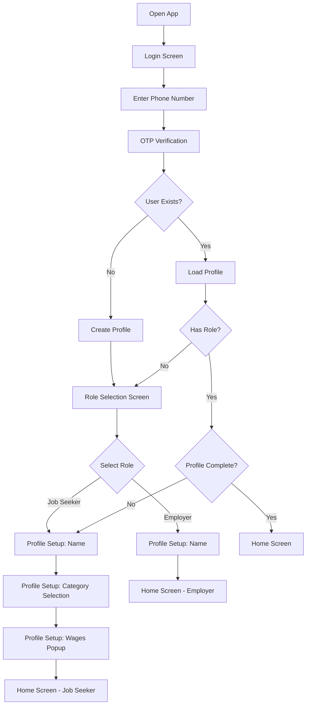
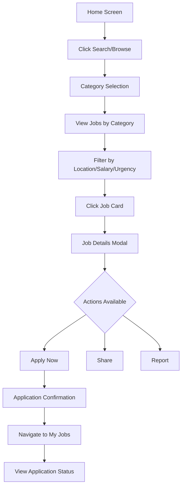
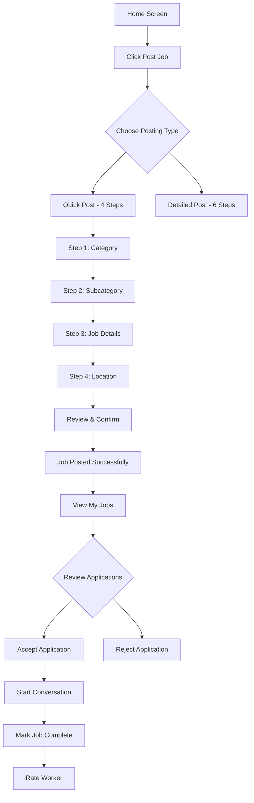
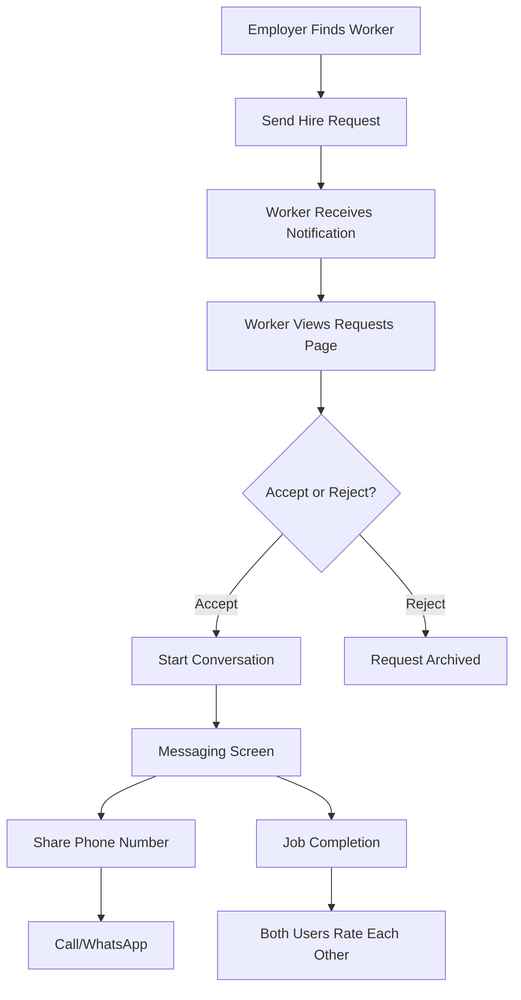
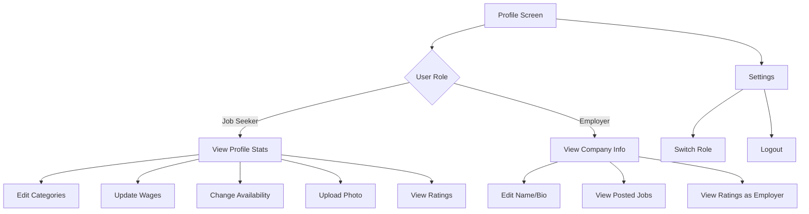
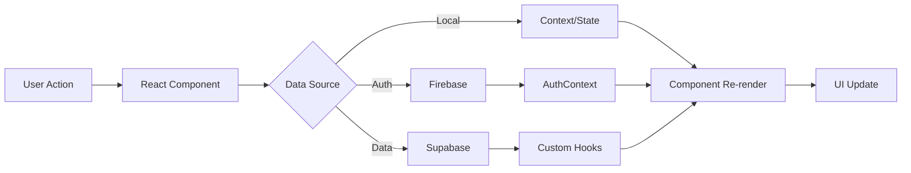

# Fyke - Complete Product Documentation
*Comprehensive Development & Design Guide*

---

## Table of Contents
1. [Product Overview](#product-overview)
2. [User Roles & Personas](#user-roles--personas)
3. [Complete User Flows](#complete-user-flows)
4. [Feature Breakdown](#feature-breakdown)
5. [Screen-by-Screen Guide](#screen-by-screen-guide)
6. [Database Architecture](#database-architecture)
7. [Technical Architecture](#technical-architecture)
8. [UI/UX Design System](#uiux-design-system)
9. [Security & Authentication](#security--authentication)
10. [API & Integration Points](#api--integration-points)

---

## Product Overview

### What is Fyke?
Fyke is a **mobile-first job marketplace platform** connecting employers with workers across India, specializing in skilled labor (construction, delivery, services, etc.). It enables instant hiring, real-time communication, and trust-based ratings.

### Core Value Proposition
- **For Job Seekers**: Find daily/project work instantly, get paid quickly, build reputation
- **For Employers**: Hire verified workers fast, post jobs in minutes, manage multiple hires
- **Platform**: Trust & transparency through ratings, secure messaging, location-based matching

### Target Market
- **Primary**: India (Hindi, English, regional languages)
- **Geography**: Urban & semi-urban areas with high daily labor demand
- **Categories**: Construction, delivery, household services, specialty trades

---

## User Roles & Personas

### 1. Job Seeker (Worker)
**Primary Goals:**
- Find daily/weekly work opportunities
- Build profile with skills, categories, and wages
- Apply to jobs and receive requests from employers
- Communicate directly with employers
- Build reputation through ratings

**Profile Components:**
- Name, phone (Firebase auth)
- Profile photo (Supabase storage)
- Categories & subcategories (e.g., Construction → Mason, Electrician)
- Skills (manual tags)
- Wage expectations (by category/subcategory, daily/weekly/monthly)
- Availability status (available/busy/offline)
- Vehicle ownership (for delivery jobs)
- Location (GPS-detected or manual)
- Average rating & reviews

**Key Actions:**
- Complete profile setup (name → categories → wages)
- Browse jobs by category/location
- Apply to jobs with optional message
- Receive & respond to direct hire requests
- Rate employers after job completion
- Manage availability

---

### 2. Employer (Hirer)
**Primary Goals:**
- Post job openings quickly
- Find skilled workers nearby
- Review applications & hire instantly
- Communicate with multiple workers
- Rate workers after job completion

**Profile Components:**
- Name, phone (Firebase auth)
- Company name (optional)
- Profile photo
- Location
- Average rating as employer

**Key Actions:**
- Post jobs (quick or detailed flow)
- Browse worker profiles by category/location
- Send direct hire requests to workers
- Review applications & accept/reject
- Mark jobs as completed
- Rate workers after job completion

---

### 3. Admin (Future/Not Fully Implemented)
**Capabilities:**
- Moderate content (jobs, profiles)
- Manage verification requests
- Handle reports
- View analytics

---

## Complete User Flows

### Flow 1: New User Onboarding (Job Seeker)



**Screens Involved:**
1. **Login Screen** (`/login`) - Phone input, OTP request, test bypass
2. **OTP Verification** (`/otp-verification`) - 6-digit OTP input
3. **Role Selection** (`/role-selection`) - Choose Job Seeker or Employer
4. **Profile Setup** (`/profile-setup`) - Multi-step form (Name, Categories, Wages)
5. **Home Screen** (`/home`) - Role-specific dashboard

**Key Logic:**
- Firebase phone authentication with test numbers (7777777777, 8888888888, 9999999999)
- Supabase profile creation on first login
- Role determines profile completion requirements
- Job seekers must set categories & wages; employers only need name

---

### Flow 2: Job Seeker - Browse & Apply



**Screens Involved:**
1. **Job Search** (`/search`) - Category grid, search, filters
2. **Job Details Modal** - Full job info, apply button, employer profile link
3. **My Jobs** (`/my-jobs`) - Applied, In-Progress, Archive tabs

**Key Features:**
- **Category-Based Search**: 10+ categories (Construction, Delivery, Household, etc.)
- **Location Filters**: GPS-based or manual area input
- **Salary Filters**: Min/max range, daily/weekly/monthly
- **Urgent Jobs**: Highlighted with urgency badge
- **Application Tracking**: Pending, Accepted, Rejected statuses

---

### Flow 3: Employer - Post Job & Hire



**Screens Involved:**
1. **Post Job** (`/post-job`) - Quick/Detailed stepper forms
2. **My Jobs** (`/my-jobs`) - Active, Completed tabs
3. **Job Details** - View applications, accept/reject actions
4. **Messaging** (`/messaging`) - Employer-worker chat
5. **Rating Modal** - 5-star rating + review text

**Quick Post Steps:**
1. **Category Selection** - Pick from 10+ categories
2. **Subcategory** (Optional) - Refine specialization
3. **Job Details** - Title, description, daily wage
4. **Location** - Manual entry or GPS detect
5. **Review** - Confirm all details
6. **Success** - Navigate to My Jobs or Post Another

**Detailed Post Adds:**
- Requirements (multi-line input)
- Salary range (min/max)
- Urgency toggle

---

### Flow 4: Requests & Communication



**Screens Involved:**
1. **Requests** (`/requests`) - Pending (Sent/Received), History (Accepted/Rejected)
2. **Messaging** (`/messaging`) - Conversation list, chat interface
3. **Rating Modal** - Post-job rating flow

**Key Features:**
- **Requests Dashboard**: Separate tabs for Sent, Received, Accepted, Rejected
- **Real-Time Messaging**: Supabase Realtime for instant delivery
- **Phone Sharing**: Secure opt-in phone number reveal
- **Call/WhatsApp Buttons**: Direct communication channels
- **Ratings System**: 5-star + review text, visible on profiles

---

### Flow 5: Profile Management



**Screens Involved:**
1. **Profile** (`/profile`) - Overview, stats, edit buttons
2. **Edit Modals** - Inline editing for categories, wages, photo

**Job Seeker Profile Sections:**
- **Header**: Photo, name, location, availability badge
- **Stats**: Total jobs, rating, completion rate
- **Categories**: Chips showing all selected categories
- **Wages**: By category/subcategory, editable
- **Skills**: Manual tags
- **Vehicle**: Ownership indicator
- **Ratings**: List of reviews from employers

**Employer Profile Sections:**
- **Header**: Photo, company name, location
- **Stats**: Jobs posted, average rating
- **Recent Jobs**: Quick links to active posts
- **Ratings**: Reviews from workers

---

## Feature Breakdown

### 1. Authentication & Onboarding
**Tech Stack**: Firebase Phone Auth, Supabase Profiles

**Features:**
- **Phone-Based Login**: OTP verification, test number bypass
- **Role Selection**: Job Seeker vs Employer
- **Profile Setup Wizard**: Multi-step form with validation
- **Session Persistence**: LocalStorage + Firebase auto-refresh
- **In-App Browser Detection**: Blocks login in Facebook/Instagram webviews

**Key Files:**
- `src/contexts/AuthContext.tsx` - Auth state management
- `src/pages/LoginScreen.tsx` - Phone input & OTP request
- `src/pages/OTPVerification.tsx` - OTP validation
- `src/pages/RoleSelection.tsx` - Role picker
- `src/pages/ProfileSetup.tsx` - Wizard stepper

---

### 2. Job Search & Discovery
**Tech Stack**: Supabase queries, location-based filters

**Features:**
- **Category-Based Navigation**: Visual grid with icons
- **Search Bar**: Keyword search across titles/descriptions
- **Advanced Filters**: Location radius, salary range, urgency, subcategories
- **Location Detection**: GPS-based or manual area entry
- **Job Cards**: Unified design with title, salary, location, urgency badge
- **Empty States**: Friendly messages when no results

**Key Files:**
- `src/pages/JobSearch.tsx` - Main search orchestration
- `src/components/search/JobSearchCategoryView.tsx` - Category grid
- `src/components/search/JobSearchResultsView.tsx` - Results list
- `src/components/search/JobSearchFilters.tsx` - Filter panel
- `src/components/common/UnifiedJobCard.tsx` - Reusable job card

---

### 3. Job Posting (Employers)
**Tech Stack**: Multi-step form, Supabase insert

**Features:**
- **Quick Post**: 4-step minimal flow (Category → Details → Location → Confirm)
- **Detailed Post**: 6-step with requirements, salary range, urgency
- **Location Detection**: Auto-fill current area
- **Subcategory Selection**: Horizontal scrollable chips
- **Draft Saving**: Not implemented (future)
- **Job Management**: Edit, delete, mark complete

**Key Files:**
- `src/pages/PostJob.tsx` - Stepper logic for both flows
- `src/components/job/QuickPostModal.tsx` - Modal wrapper
- `src/hooks/useEmployerJobs.ts` - Fetch employer's posted jobs

---

### 4. Applications & Hiring
**Tech Stack**: Supabase applications table, status updates

**Features:**
- **One-Click Apply**: Job seekers apply with optional message
- **Application Review**: Employers see applicant profiles
- **Accept/Reject**: Update application status
- **Status Tracking**: Pending → Accepted → In-Progress → Completed
- **Withdraw Application**: Job seekers can cancel pending applications

**Key Files:**
- `src/hooks/useMyApplications.ts` - Job seeker's applications
- `src/hooks/useEmployerApplications.ts` - Employer's received applications
- `src/pages/MyJobs.tsx` - Dashboard for both roles

---

### 5. Requests System
**Tech Stack**: Custom request flow (not fully Supabase-backed)

**Features:**
- **Direct Hire**: Employers send requests to workers
- **Pending Requests**: Separate tabs for sent/received
- **Accept/Reject**: Worker decision flow
- **History**: Archived accepted/rejected requests
- **Ratings Post-Acceptance**: Both parties rate after job completion

**Key Files:**
- `src/pages/Requests.tsx` - Main requests dashboard
- `src/hooks/useRequests.ts` - Request state management
- `src/components/rating/RatingModal.tsx` - Post-job rating UI

---

### 6. Messaging & Communication
**Tech Stack**: Supabase conversations, Realtime subscriptions

**Features:**
- **Conversation List**: All active chats with unread counts
- **Real-Time Chat**: Message delivery via Supabase Realtime
- **Phone Sharing**: Opt-in reveal of phone numbers
- **Call/WhatsApp Buttons**: Direct communication outside app
- **Read Status**: Track message read state

**Key Files:**
- `src/pages/Messaging.tsx` - Messaging page wrapper
- `src/components/messaging/EnhancedMessaging.tsx` - Chat UI
- `src/hooks/useConversations.ts` - Fetch conversations
- `src/hooks/useMessages.ts` - Send/receive messages

---

### 7. Notifications
**Tech Stack**: Supabase notifications table, push notifications (Capacitor)

**Features:**
- **Notification Types**: Job match, application update, message, rating, payment
- **Badge Counts**: Unread notifications indicator
- **Action Buttons**: Navigate to relevant screen from notification
- **Mark as Read**: Individual or bulk mark as read
- **Real-Time Updates**: New notifications appear instantly

**Key Files:**
- `src/pages/Notifications.tsx` - Notifications list
- `src/hooks/useNotifications.ts` - Notification state
- `src/services/notificationService.ts` - Push notification handling

---

### 8. Ratings & Reviews
**Tech Stack**: Supabase ratings table

**Features:**
- **5-Star Rating**: Visual star picker
- **Review Text**: Min 10 characters, max 500
- **Dual Rating**: Both employer & worker rate each other
- **Rating Blocker**: Prevent duplicate ratings
- **Average Rating Display**: On profile cards & details
- **Review History**: List of all reviews on profile

**Key Files:**
- `src/components/rating/RatingModal.tsx` - Rating form
- `src/components/rating/RatingBlocker.tsx` - Prevent duplicate ratings
- `src/hooks/useRatings.ts` - Submit & fetch ratings

---

### 9. Profile Management
**Tech Stack**: Supabase profiles table, storage for photos

**Features:**
- **Profile Photo Upload**: Supabase storage integration
- **Category Management**: Add/remove categories & subcategories
- **Wage Setting**: Per category/subcategory, daily/weekly/monthly
- **Availability Toggle**: Available, Busy, Offline
- **Vehicle Ownership**: Boolean flag for delivery jobs
- **Location Update**: GPS or manual
- **Bio/Description**: Free text field

**Key Files:**
- `src/pages/Profile.tsx` - Profile overview
- `src/components/profile/EnhancedProfile.tsx` - Profile UI
- `src/components/profile/ProfilePhotoUpload.tsx` - Photo upload
- `src/components/profile/EditableProfileCard.tsx` - Inline editing

---

### 10. Localization (i18n)
**Tech Stack**: React-i18next

**Features:**
- **Multi-Language**: Hindi, English (extensible to regional languages)
- **Language Selection**: On first launch or settings
- **Fallback**: English as default
- **Translation Keys**: Organized by feature (job, profile, rating, etc.)

**Key Files:**
- `src/contexts/LocalizationContext.tsx` - i18n context
- `src/data/localization/` - Translation files
- `src/hooks/useLocalization.ts` - Translation hook

---

## Screen-by-Screen Guide

### 1. Login Screen (`/login`)
**Purpose**: Authenticate users via phone number

**UI Elements:**
- App logo & branding
- Phone number input (10 digits, +91 prefix)
- "Send OTP" button
- Recaptcha container (invisible)
- Test number indicator (dev mode)

**User Actions:**
- Enter phone number
- Click "Send OTP"
- Redirected to OTP screen

**Technical Details:**
- Firebase `signInWithPhoneNumber()`
- Test bypass for 7777777777, 8888888888, 9999999999
- In-app browser detection (blocks Facebook/Instagram webviews)

---

### 2. OTP Verification (`/otp-verification`)
**Purpose**: Verify phone ownership

**UI Elements:**
- 6-digit OTP input boxes
- "Verify" button
- Resend OTP link (with countdown)
- Test OTP hints (dev mode)

**User Actions:**
- Enter OTP from SMS
- Click "Verify"
- Redirected to role selection (new user) or home (existing)

**Technical Details:**
- Firebase `ConfirmationResult.confirm()`
- Test OTPs: 333333 (7777777777), 111111 (8888888888), 222222 (9999999999)
- Supabase profile lookup/creation

---

### 3. Role Selection (`/role-selection`)
**Purpose**: Choose Job Seeker or Employer role

**UI Elements:**
- Two large role cards with icons & descriptions
- Features list for each role
- "Continue as [Role]" button

**User Actions:**
- Tap one role card (selection highlight)
- Click "Continue"
- Redirected to profile setup

**Technical Details:**
- Updates `profiles.role` in Supabase
- Sets `profileComplete = false`
- Clears localStorage user cache

---

### 4. Profile Setup (`/profile-setup`)
**Purpose**: Complete initial profile (name, categories, wages)

**UI Elements (Job Seeker):**
- **Step 1**: Name input (full name)
- **Step 2**: Category selection grid (10+ categories)
- **Step 3**: Wages popup (per category, daily/weekly/monthly)

**UI Elements (Employer):**
- **Step 1**: Name input (company name)
- **Step 2**: Category selection (optional, for job posting)

**User Actions:**
- Enter name → Next
- Select categories → Next
- Set wages (job seeker only) → Complete
- Redirected to home screen

**Technical Details:**
- Multi-step form with validation
- Updates `profiles.name`, `profiles.categories`, `profiles.wages`
- Sets `profileComplete = true` on finish

---

### 5. Home Screen (`/home`)
**Purpose**: Role-specific dashboard

**Job Seeker Home:**
- Greeting with name & availability status
- Quick stats (jobs applied, profile views)
- Featured jobs carousel
- "Browse Jobs" CTA
- Bottom navigation bar

**Employer Home:**
- Greeting with company name
- Quick actions (Post Job, Find Workers)
- Recent activity (applications, messages)
- Active jobs list
- Bottom navigation bar

**User Actions:**
- Navigate to search, jobs, requests, messaging, profile
- Quick post job (employers)
- Quick apply to jobs (job seekers)

**Technical Details:**
- Fetches user-specific data (jobs, applications, requests)
- Real-time updates for notifications

---

### 6. Job Search (`/search`)
**Purpose**: Browse & filter jobs by category/location

**UI Elements:**
- Category grid (10+ categories with icons)
- Search bar (keyword search)
- Filter panel (location, salary, urgency)
- Job cards list (title, salary, location, urgency badge)
- Empty state (no results)

**User Actions:**
- Select category → View jobs
- Apply filters → Refresh results
- Click job card → Open job details modal
- Apply to job

**Technical Details:**
- Supabase query with filters
- Location-based filtering (GPS or manual)
- Urgent jobs highlighted

---

### 7. Job Details Modal
**Purpose**: Display full job information & allow actions

**UI Elements:**
- Job title, category, subcategories
- Employer name & profile link
- Location, salary, urgency badge
- Job description
- Requirements list
- "Apply Now" button
- "Share" & "Report" buttons

**User Actions:**
- Apply to job (one-click)
- View employer profile
- Share job link
- Report job (abuse, scam)

**Technical Details:**
- Fetches job + employer data
- Creates application record in Supabase
- Sends notification to employer

---

### 8. Post Job (`/post-job`)
**Purpose**: Employers create job postings

**Quick Post Flow:**
1. **Category Selection**: Grid of categories
2. **Subcategory** (Optional): Horizontal chips
3. **Job Details**: Title, description, daily wage
4. **Location**: GPS detect or manual entry
5. **Review**: Confirm all details
6. **Success**: Navigate to My Jobs

**Detailed Post Adds:**
- Requirements (multi-line)
- Salary range (min/max)
- Salary period (daily/weekly/monthly)
- Urgency toggle

**User Actions:**
- Fill form step-by-step
- Detect location or enter manually
- Review & confirm → Job posted

**Technical Details:**
- Multi-step stepper form
- Inserts into `jobs` table
- Notifies relevant job seekers

---

### 9. My Jobs (`/my-jobs`)
**Purpose**: Manage applications (job seeker) or posted jobs (employer)

**Job Seeker View:**
- **Tabs**: Applied, In-Progress, Archive
- **Cards**: Job title, company, location, salary, application status
- **Actions**: View Job, Withdraw Application

**Employer View:**
- **Tabs**: Active, Completed
- **Cards**: Job title, location, salary, status, applicant count
- **Actions**: View, Edit, Delete, Mark Complete

**User Actions:**
- Switch tabs to view different job states
- Click job to view details
- Withdraw application (job seeker)
- Edit/delete job (employer)

**Technical Details:**
- Fetches from `applications` (job seeker) or `jobs` (employer)
- Status updates trigger notifications

---

### 10. Requests (`/requests`)
**Purpose**: Manage direct hire requests

**UI Elements:**
- **Tabs**: Pending, History
- **Pending**: Sent (by me), Received (to accept/reject)
- **History**: Accepted, Rejected
- **Cards**: Worker/employer profile, request details, action buttons

**User Actions:**
- Accept request → Start conversation
- Reject request → Archive
- View worker/employer profile
- Rate after accepted job completion

**Technical Details:**
- Custom request system (not fully Supabase-backed)
- Triggers conversation creation on accept

---

### 11. Messaging (`/messaging`)
**Purpose**: Real-time chat between employers & workers

**UI Elements:**
- **Left Pane**: Conversation list (name, last message, unread count)
- **Right Pane**: Chat interface (messages, input box)
- **Actions**: Send message, share phone, call, WhatsApp

**User Actions:**
- Select conversation → Open chat
- Send text message
- Share phone number (opt-in)
- Call or WhatsApp directly

**Technical Details:**
- Supabase `conversations` & `conversation_messages` tables
- Real-time updates via Supabase Realtime
- Phone sharing tracked in `phone_shares` table

---

### 12. Notifications (`/notifications`)
**Purpose**: Display all system notifications

**UI Elements:**
- **Tabs**: All, Unread
- **Cards**: Notification icon, title, message, timestamp, type badge, action button
- **Header**: "Mark all as read" button

**User Actions:**
- Tap notification → Navigate to relevant screen
- Mark as read (individual or bulk)

**Technical Details:**
- Fetches from `notifications` table
- Real-time updates for new notifications
- Push notifications via Capacitor (mobile only)

---

### 13. Profile (`/profile`)
**Purpose**: View & edit user profile

**UI Elements:**
- Profile photo (editable)
- Name, location, availability badge
- Stats (jobs, rating, completion rate)
- Categories chips (editable)
- Wages table (editable)
- Skills tags (editable)
- Ratings & reviews list
- Settings (logout, switch role)

**User Actions:**
- Upload/change profile photo
- Edit name, bio, location
- Add/remove categories
- Update wages
- Toggle availability
- Logout

**Technical Details:**
- Updates `profiles` table
- Photo upload to Supabase storage bucket `avatars`
- Inline editing with modals

---

### 14. Worker Profile Modal
**Purpose**: Employers view worker details before hiring

**UI Elements:**
- Worker photo, name, location, rating
- Categories & subcategories
- Skills
- Wages table
- Ratings & reviews
- "Send Request" button

**User Actions:**
- View full profile
- Send hire request
- Navigate to messaging (if conversation exists)

**Technical Details:**
- Fetches worker profile from `profiles`
- Creates request record

---

### 15. Rating Modal
**Purpose**: Rate employer/worker after job completion

**UI Elements:**
- 5-star picker (visual stars)
- Review text area (min 10 chars, max 500)
- Professional responsibility notice
- "Submit Rating" button

**User Actions:**
- Select rating (1-5 stars)
- Write review
- Submit

**Technical Details:**
- Creates record in `ratings` table
- Updates average rating on user profile
- Prevents duplicate ratings via `RatingBlocker`

---

## Database Architecture

### Core Tables

#### 1. `profiles`
**Purpose**: User profile data (both job seekers & employers)

| Column | Type | Description |
|--------|------|-------------|
| `id` | UUID | Primary key (matches Firebase UID) |
| `firebase_uid` | TEXT | Firebase authentication UID |
| `phone` | TEXT | Phone number |
| `email` | TEXT | Email address (optional) |
| `name` | TEXT | Full name or company name |
| `role` | TEXT | 'jobseeker' or 'employer' |
| `profile_photo` | TEXT | URL to Supabase storage |
| `bio` | TEXT | Profile description |
| `location` | TEXT | Area/city name |
| `latitude` | NUMERIC | GPS latitude |
| `longitude` | NUMERIC | GPS longitude |
| `categories` | TEXT[] | Array of category IDs |
| `subcategories` | TEXT[] | Array of subcategory names |
| `skills` | TEXT[] | Manual skill tags |
| `wages` | JSONB | `{ categoryId: { rate, unit } }` |
| `category_wages` | JSONB | Legacy wages field |
| `salary_by_subcategory` | JSONB | `{ subcategory: { amount, period } }` |
| `vehicle` | TEXT | Vehicle type (for delivery) |
| `availability` | TEXT | 'available', 'busy', 'offline' |
| `verified` | BOOLEAN | Verification status |
| `profile_complete` | BOOLEAN | Onboarding completion flag |
| `primary_category` | TEXT | Main category |
| `created_at` | TIMESTAMP | Account creation |
| `updated_at` | TIMESTAMP | Last profile update |

**RLS Policies:**
- Public can view all profiles (for worker discovery)
- Users can update their own profile
- Users can insert their own profile

---

#### 2. `jobs`
**Purpose**: Job postings by employers

| Column | Type | Description |
|--------|------|-------------|
| `id` | UUID | Primary key |
| `employer_id` | UUID | References `profiles.id` |
| `title` | TEXT | Job title |
| `description` | TEXT | Job description |
| `category_id` | TEXT | Category ID |
| `subcategory_id` | UUID | Subcategory reference |
| `subcategories` | TEXT[] | Array of subcategory names |
| `location` | TEXT | Job location |
| `salary_min` | NUMERIC | Minimum salary |
| `salary_max` | NUMERIC | Maximum salary |
| `salary_period` | TEXT | 'daily', 'weekly', 'monthly' |
| `requirements` | TEXT[] | Job requirements list |
| `urgent` | BOOLEAN | Urgent job flag |
| `status` | TEXT | 'active', 'filled', 'expired', 'draft' |
| `posted_at` | TIMESTAMP | Job post time |
| `created_at` | TIMESTAMP | Creation time |
| `updated_at` | TIMESTAMP | Last update |

**RLS Policies:**
- Anyone can view active jobs
- Employers can create jobs (with role check)
- Employers can manage their own jobs

---

#### 3. `applications`
**Purpose**: Job applications from job seekers

| Column | Type | Description |
|--------|------|-------------|
| `id` | UUID | Primary key |
| `job_id` | UUID | References `jobs.id` |
| `applicant_id` | UUID | References `profiles.id` |
| `employer_id` | UUID | References `profiles.id` |
| `status` | TEXT | 'pending', 'accepted', 'rejected' |
| `applied_at` | TIMESTAMP | Application time |

**RLS Policies:**
- Job seekers can create applications (with role check)
- Users can view applications for their jobs or their own applications
- Employers can update applications for their jobs

---

#### 4. `conversations`
**Purpose**: Chat conversations between users

| Column | Type | Description |
|--------|------|-------------|
| `id` | UUID | Primary key |
| `user1_id` | UUID | First participant |
| `user2_id` | UUID | Second participant |
| `job_id` | UUID | Related job (optional) |
| `last_message_at` | TIMESTAMP | Last message timestamp |
| `created_at` | TIMESTAMP | Conversation creation |

**RLS Policies:**
- Users can view their own conversations
- Users can create conversations
- Users can update their own conversations
- Users can delete their own conversations

---

#### 5. `conversation_messages`
**Purpose**: Messages within conversations

| Column | Type | Description |
|--------|------|-------------|
| `id` | UUID | Primary key |
| `conversation_id` | UUID | References `conversations.id` |
| `sender_id` | UUID | Message sender |
| `content` | TEXT | Message text |
| `read` | BOOLEAN | Read status |
| `created_at` | TIMESTAMP | Message time |

**RLS Policies:**
- Users can send messages in their conversations
- Users can view messages in their conversations
- Users can update their own messages

---

#### 6. `notifications`
**Purpose**: System notifications for users

| Column | Type | Description |
|--------|------|-------------|
| `id` | UUID | Primary key |
| `user_id` | UUID | Notification recipient |
| `type` | TEXT | Notification type (job_match, application_update, etc.) |
| `title` | TEXT | Notification title |
| `message` | TEXT | Notification message |
| `data` | JSONB | Additional data (job_id, etc.) |
| `read` | BOOLEAN | Read status |
| `created_at` | TIMESTAMP | Notification time |

**RLS Policies:**
- Users can view their own notifications
- Users can mark their notifications as read

---

#### 7. `ratings`
**Purpose**: User ratings & reviews

| Column | Type | Description |
|--------|------|-------------|
| `id` | UUID | Primary key |
| `from_user_id` | UUID | Rater |
| `to_user_id` | UUID | Ratee |
| `request_id` | UUID | Related request/job |
| `rating` | INTEGER | Star rating (1-5) |
| `comment` | TEXT | Review text |
| `created_at` | TIMESTAMP | Rating time |

**RLS Policies:**
- (Not fully implemented, needs policies)

---

#### 8. `phone_shares`
**Purpose**: Track phone number sharing between users

| Column | Type | Description |
|--------|------|-------------|
| `id` | UUID | Primary key |
| `conversation_id` | UUID | Related conversation |
| `user_id` | UUID | User who shared phone |
| `shared_at` | TIMESTAMP | Share time |

**RLS Policies:**
- Users can share their own phone
- Users can view phone shares in their conversations

---

#### 9. `categories`
**Purpose**: Job categories (static data)

| Column | Type | Description |
|--------|------|-------------|
| `id` | TEXT | Category ID |
| `name` | TEXT | Category name |
| `icon` | TEXT | Emoji icon |
| `description` | TEXT | Category description |
| `active` | BOOLEAN | Active status |
| `created_at` | TIMESTAMP | Creation time |

**RLS Policies:**
- Anyone can view active categories

---

#### 10. `subcategories`
**Purpose**: Job subcategories (nested under categories)

| Column | Type | Description |
|--------|------|-------------|
| `id` | UUID | Primary key |
| `category_id` | TEXT | References `categories.id` |
| `name` | TEXT | Subcategory name |
| `description` | TEXT | Description |
| `active` | BOOLEAN | Active status |
| `created_at` | TIMESTAMP | Creation time |

**RLS Policies:**
- Anyone can view active subcategories

---

### Database Functions

#### `get_user_conversations_with_details_v5(user_id uuid)`
**Purpose**: Fetch all conversations for a user with details

**Returns:**
- Conversation ID
- Other user info (name, photo)
- Last message & sender
- Unread message count
- Job info (if applicable)
- Phone share status

---

#### `create_system_notification(...)`
**Purpose**: Create notification for a user (used by triggers)

**Parameters:**
- `target_user_id`: Recipient
- `notification_type`: Type string
- `notification_title`: Title
- `notification_message`: Message
- `notification_data`: JSONB data

---

#### `handle_new_user()`
**Purpose**: Trigger function to create profile on Firebase user creation

---

### Storage Buckets

#### `avatars`
**Purpose**: User profile photos
**Public**: Yes
**Path Structure**: `{user_id}/{filename}`

**RLS Policies:**
- Anyone can view avatars
- Users can upload/update their own avatars

---

## Technical Architecture

### Frontend Stack
- **Framework**: React 18 + TypeScript
- **Build Tool**: Vite
- **Routing**: React Router v6
- **State Management**: Context API (Auth, Job, Localization)
- **UI Library**: Radix UI + Custom Components
- **Styling**: Tailwind CSS + CSS Variables
- **Forms**: React Hook Form + Zod validation
- **Animations**: Framer Motion
- **Icons**: Lucide React
- **Date Handling**: date-fns
- **Localization**: react-i18next

### Backend Stack
- **Database**: Supabase (PostgreSQL)
- **Authentication**: Firebase Phone Auth
- **File Storage**: Supabase Storage
- **Real-Time**: Supabase Realtime (WebSockets)
- **Edge Functions**: Supabase Edge Functions (Deno)

### Mobile Stack
- **Mobile Framework**: Capacitor 7
- **Native Plugins**: Geolocation, Push Notifications, Haptics, Local Notifications
- **AdMob**: Capacitor AdMob plugin

### Key Libraries
```json
{
  "@supabase/supabase-js": "^2.51.0",
  "firebase": "^11.10.0",
  "@tanstack/react-query": "^5.56.2",
  "react-router-dom": "^6.26.2",
  "framer-motion": "^12.23.6",
  "react-hook-form": "^7.53.0",
  "zod": "^3.23.8",
  "i18next": "^25.2.1"
}
```

---

### Component Architecture

#### Core Contexts
1. **AuthContext** - User authentication, profile, role management
2. **JobContext** - Job listings, applications, ratings
3. **LocalizationContext** - Multi-language support
4. **CommunicationContext** - Messaging & phone sharing

#### Reusable Components
1. **UnifiedJobCard** - Job display card (used in search, home, my-jobs)
2. **UnifiedWorkerCard** - Worker profile card (used in search, requests)
3. **AccessibleCard** - Accessible wrapper for all cards
4. **BottomNavigation** - Mobile navigation bar
5. **StickyFooterButton** - Fixed bottom action button
6. **FloatingCard** - Elevated card with animations
7. **RatingModal** - Star rating + review form
8. **EnhancedMessaging** - Chat interface

#### Specialized Components
1. **ProfilePhotoUpload** - Avatar upload with preview
2. **ModernCategoryStep** - Category selection grid
3. **ModernMultiSalaryStep** - Wage setting form
4. **JobSearchFilters** - Filter panel
5. **QuickPostModal** - Job posting wizard

---

### Data Flow



---

## UI/UX Design System

### Color Palette (HSL)
```css
:root {
  /* Primary Colors */
  --primary: 217 91% 60%;  /* Blue */
  --primary-foreground: 0 0% 100%;
  
  /* Secondary Colors */
  --secondary: 217 91% 95%;
  --secondary-foreground: 217 91% 20%;
  
  /* Accent Colors */
  --accent: 217 91% 95%;
  --accent-foreground: 217 91% 20%;
  
  /* Status Colors */
  --success: 142 76% 36%;  /* Green */
  --warning: 38 92% 50%;   /* Orange */
  --error: 0 84% 60%;      /* Red */
  
  /* Neutral Colors */
  --background: 0 0% 100%;
  --foreground: 222.2 84% 4.9%;
  --muted: 210 40% 96.1%;
  --muted-foreground: 215.4 16.3% 46.9%;
  
  /* Border & Card */
  --border: 214.3 31.8% 91.4%;
  --card: 0 0% 100%;
  --card-foreground: 222.2 84% 4.9%;
}
```

### Typography
- **Font Family**: System fonts (sans-serif)
- **Headings**: Bold, 1.5rem - 2.5rem
- **Body**: Regular, 0.875rem - 1rem
- **Small**: 0.75rem

### Spacing
- **Base Unit**: 4px (0.25rem)
- **Common Values**: 4, 8, 12, 16, 24, 32, 48px
- **Container Max Width**: 1200px
- **Mobile Padding**: 16px
- **Desktop Padding**: 24px

### Component Patterns

#### Card Style
```css
.card {
  background: var(--card);
  border: 1px solid var(--border);
  border-radius: 0.75rem;
  padding: 1rem;
  box-shadow: 0 1px 3px rgba(0, 0, 0, 0.1);
  transition: box-shadow 0.2s;
}
.card:hover {
  box-shadow: 0 4px 6px rgba(0, 0, 0, 0.1);
}
```

#### Button Variants
- **Primary**: Blue background, white text
- **Secondary**: Light blue background, blue text
- **Outline**: White background, blue border
- **Ghost**: Transparent, blue text on hover
- **Destructive**: Red background, white text

#### Badge Variants
- **Default**: Gray background
- **Success**: Green background
- **Warning**: Orange background
- **Error**: Red background
- **Outline**: Transparent with border

---

### Responsive Design
- **Mobile First**: 320px - 768px (primary target)
- **Tablet**: 768px - 1024px
- **Desktop**: 1024px+

**Breakpoints:**
```css
@media (min-width: 640px) { /* sm */ }
@media (min-width: 768px) { /* md */ }
@media (min-width: 1024px) { /* lg */ }
@media (min-width: 1280px) { /* xl */ }
```

---

### Accessibility Features
- **Keyboard Navigation**: All interactive elements focusable
- **ARIA Labels**: Buttons, links, and cards have descriptive labels
- **Focus States**: Visible focus rings on all interactive elements
- **Color Contrast**: WCAG AA compliant
- **Screen Reader Support**: Semantic HTML, ARIA roles

---

## Security & Authentication

### Firebase Phone Authentication
- **Provider**: Firebase Auth
- **Method**: Phone number + OTP
- **Session**: Persisted via Firebase SDK
- **Test Numbers**: Bypass for 7777777777, 8888888888, 9999999999

### Supabase Row-Level Security (RLS)
- **Profiles**: Users can only update their own profile
- **Jobs**: Employers can only manage their own jobs
- **Applications**: Users can only view their own applications or jobs they posted
- **Conversations**: Users can only access conversations they're part of
- **Messages**: Users can only send/view messages in their conversations

### Data Validation
- **Frontend**: Zod schemas for form validation
- **Backend**: PostgreSQL constraints, triggers
- **File Upload**: Size limits (5MB for avatars), type validation (images only)

### Security Best Practices
- **No SQL Injection**: All queries use parameterized statements
- **XSS Prevention**: React auto-escapes user content
- **CSRF**: Not applicable (SPA with JWT)
- **Rate Limiting**: (Not implemented, future improvement)

---

## API & Integration Points

### Supabase Client
```typescript
import { supabase } from '@/integrations/supabase/client';

// Example: Fetch jobs
const { data: jobs, error } = await supabase
  .from('jobs')
  .select('*')
  .eq('status', 'active')
  .order('posted_at', { ascending: false });
```

### Firebase Auth
```typescript
import { auth } from '@/lib/firebase';
import { signInWithPhoneNumber } from 'firebase/auth';

// Example: Send OTP
const confirmation = await signInWithPhoneNumber(auth, phone, recaptchaVerifier);
```

### Geolocation API
```typescript
import { geolocationService } from '@/services/geolocationService';

// Example: Get current location
const location = await geolocationService.getCurrentLocation();
// Returns: { latitude, longitude, accuracy }
```

### Push Notifications (Capacitor)
```typescript
import { notificationService } from '@/services/notificationService';

// Example: Send notification
await notificationService.sendNotification({
  title: 'New Job Match',
  body: 'Check out this new opportunity!',
  data: { jobId: '123' }
});
```

---

## Key User Journeys Summary

### Job Seeker Journey
1. **Onboarding**: Login → Role Selection → Profile Setup (Name, Categories, Wages)
2. **Job Discovery**: Browse categories → Filter by location/salary → View job details
3. **Application**: Apply with one click → Track status in My Jobs
4. **Communication**: Receive hire request → Accept → Start conversation
5. **Completion**: Job finishes → Rate employer → Build reputation

### Employer Journey
1. **Onboarding**: Login → Role Selection → Profile Setup (Name)
2. **Job Posting**: Quick/Detailed post → Select category → Enter details → Confirm
3. **Hiring**: Review applications → Accept → Start conversation → Share phone
4. **Management**: Mark job complete → Rate worker → Post new job

---

## Future Enhancements (Not Yet Implemented)

### MVP Gaps
- [ ] Payment integration (Razorpay/Stripe)
- [ ] Advanced verification (ID, skill certificates)
- [ ] Job matching algorithm (ML-based recommendations)
- [ ] In-app video calls
- [ ] Offline mode (PWA with service worker)
- [ ] Admin dashboard (content moderation, analytics)
- [ ] Job drafts & scheduled posts
- [ ] Push notification preferences
- [ ] Multi-device sync
- [ ] Dark mode

### Growth Features
- [ ] Referral program
- [ ] Premium subscriptions (verified badge, priority listings)
- [ ] Job bidding (workers bid on jobs)
- [ ] Contracts & agreements (digital signatures)
- [ ] Time tracking & timesheets
- [ ] Attendance management
- [ ] Payroll integration

---

## Development Guidelines

### Code Style
- **TypeScript**: Strict mode enabled
- **Naming**: camelCase for variables, PascalCase for components
- **Files**: One component per file, colocate styles
- **Imports**: Absolute imports with `@/` alias

### Testing
- **Manual Testing**: Test all flows on mobile (Android/iOS)
- **Automated Tests**: Playwright (in progress)
- **Test Users**: 7777777777 (OTP: 333333), 8888888888 (OTP: 111111)

### Deployment
- **Frontend**: Lovable.dev (auto-deploy on push)
- **Database**: Supabase (managed)
- **Mobile**: Capacitor build for Android/iOS

---

## Glossary

- **Job Seeker**: User looking for work (worker, laborer)
- **Employer**: User hiring workers (contractor, business owner)
- **Request**: Direct hire invitation from employer to worker
- **Application**: Job application from worker to posted job
- **Conversation**: Chat thread between two users
- **Rating**: 5-star review + text feedback
- **Category**: Job type (e.g., Construction, Delivery)
- **Subcategory**: Specialization (e.g., Mason, Electrician)
- **Wage**: Expected payment (daily/weekly/monthly)
- **Urgency**: Job flag indicating immediate need
- **Availability**: Worker status (available, busy, offline)

---

## Contact & Support

**Development Team**: Fyke Development Team  
**Documentation Version**: 1.0  
**Last Updated**: 2025-01-19  

For questions or contributions, refer to the README.md or contact the project maintainers.
